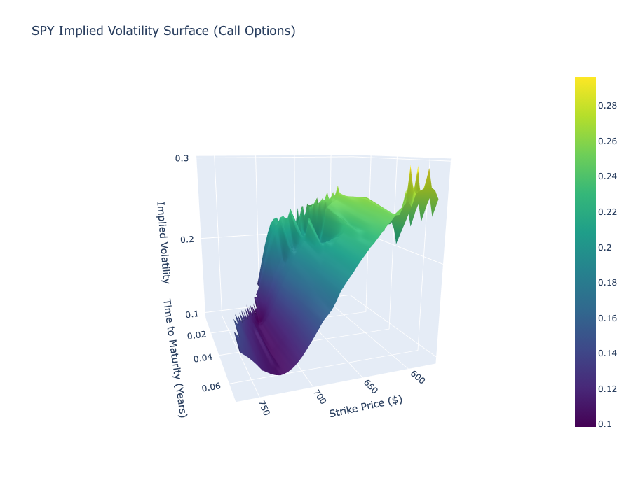

# volatility-surface-visualizer

This project constructs a 3D Implied Volatility Surface for the S&P 500 ETF (SPY) by reverse-engineering live market prices.

Unlike standard tools that just download implied volatility data, this engine calculates it from scratch using a custom Newton-Raphson numerical solver. It scrapes live option chains, processes jagged data, and visualizes the volatility structure as Strike vs. Time vs. Volatility.

